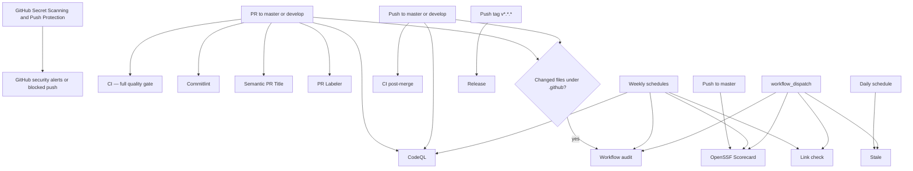
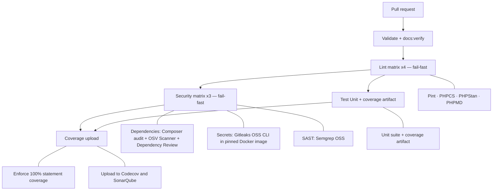

# GitHub Actions workflow flow

This document describes the workflows currently defined in
`.github/workflows/`. Jobs run on GitHub-hosted `ubuntu-latest` runners;
PHP-related commands run through `tools/ci/docker-compose` (repository Docker
image `jooservices/exceptions:php85`). The pull-request gate and the post-merge
pass are split into two workflows; branch protection on `master`/`develop`
requires the pull-request checks before merge.

## Overall event flow



## Pull-request gate (`ci.yml`)

**Trigger:** pull requests targeting `master` or `develop`.
Concurrent runs for the same pull request cancel older in-progress runs.



## Post-merge pass (`ci-post-merge.yml`)

**Trigger:** pushes to `master` or `develop` (i.e., right after a merge).

```text
Validate → Test Unit → Coverage upload → Codecov + Sonar
```

## Release flow (`release.yml`)

**Trigger:** push of a tag matching `v*.*.*`. Runs are not cancelled.
Fails if the tag is not reachable from `origin/master`.

## Other workflows

| Workflow | Trigger | Flow / result |
| --- | --- | --- |
| `codeql.yml` | Push/PR on `master` or `develop`; Monday 06:00 UTC | CodeQL for GitHub Actions |
| `commitlint.yml` | PR opened, edited, synchronized, reopened | Conventional Commits via `.github/commitlint.config.mjs` |
| `semantic-pr.yml` | PR opened, edited | PR title type + uppercase subject |
| `pr-labeler.yml` | PR opened, synchronized, reopened | Path labels from `.github/labeler.yml` |
| `link-check.yml` | Monday 04:00 UTC; manual | Lychee Markdown link check |
| `scorecard.yml` | Push to `master`; Monday 00:00 UTC; manual | OpenSSF Scorecard (GitHub-hosted) |
| `stale.yml` | Daily 01:00 UTC; manual | Stale issues/PRs |
| `workflow-audit.yml` | `.github/**` changes; Monday 03:00 UTC; manual | Actionlint + Zizmor |

## Branch protection

Both `master` and `develop` require pull requests with these status checks:
`Validate`, the four `Lint (…)` legs, the three `Security (…)` legs,
`Test (Unit)`, `Coverage upload`, `Validate commit messages`, and
`Validate PR Title`. Strict mode requires the branch to be up to date.
Force pushes and deletions are denied.

## Notes

- All declared workflows use dedicated repository configuration; none use
  `jooservices/workflows`.
- Secret scanning has two layers: GitHub Secret Scanning and Push Protection,
  plus Gitleaks in the PR security gate.
- Coverage gate is **100%** statement coverage (`tools/ensure-coverage.php`).
- Containers run as the runner user through `tools/ci/docker-compose`
  (`DOCKER_UID`/`DOCKER_GID`).
