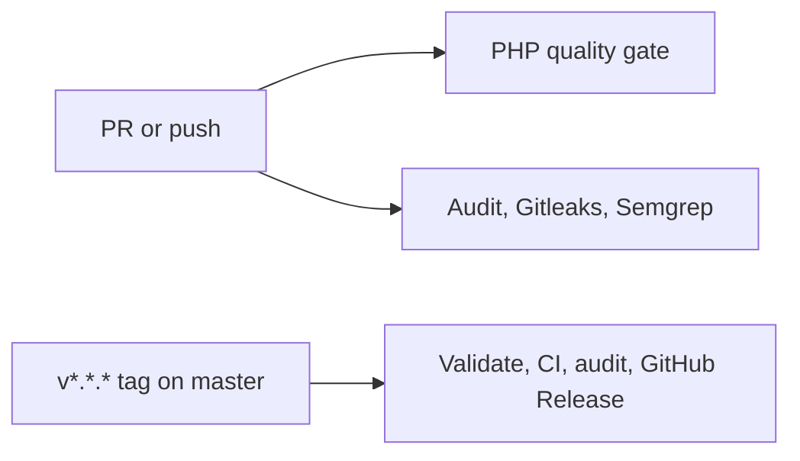

# GitHub Actions workflow guide

All PHP jobs run in the repository Docker image on GitHub-hosted Ubuntu
runners.

`ci.yml` runs Composer validation, the full `composer ci` gate, dependency
audit, Gitleaks, and Semgrep. `release.yml` rejects tags not reachable from
`master`, repeats validation, and creates GitHub release notes. Codecov and
Sonar badges become live once their organization integrations are enabled.
