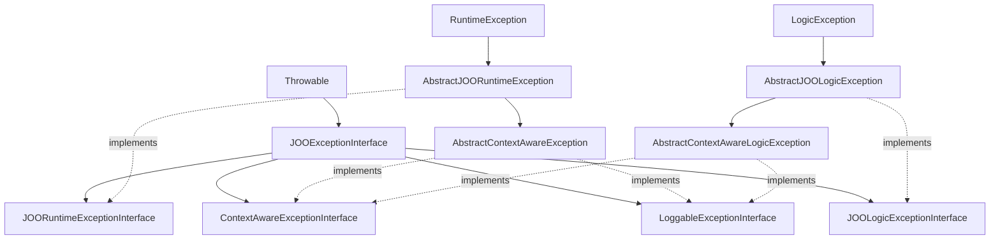

# Exception Hierarchy

## Structure guidelines

1. **Leaf classes**: concrete `final` exception classes per failure state, created through static factories.
2. **Abstract bases**: runtime vs logic, preserving SPL semantics.
3. **Context bases**: `AbstractContextAwareException` (runtime) and `AbstractContextAwareLogicException` (logic).
4. **Markers**: `JOOExceptionInterface` (+ runtime/logic markers) on every package-level base.
5. **Trait escape hatch**: `HasExceptionContext` when a third-party parent blocks inheritance; call `initContext()` and implement `copyWithContext()`.
